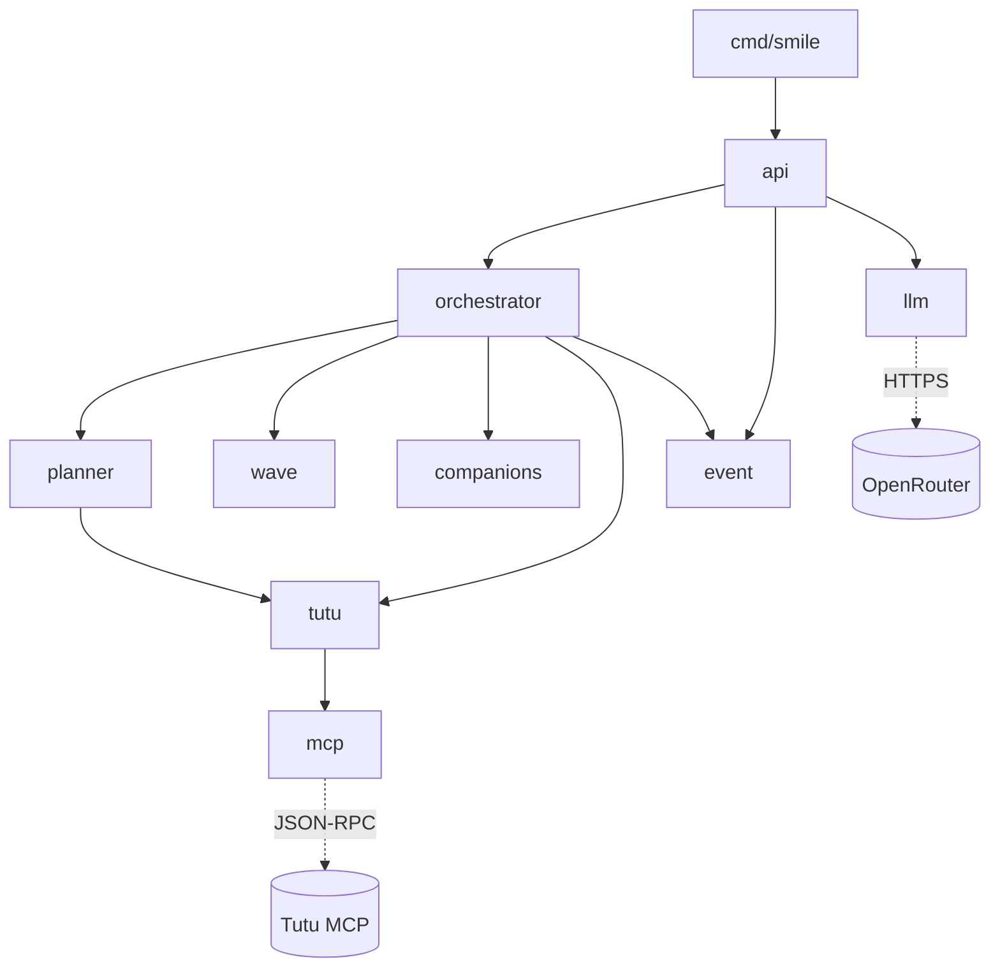

# Архитектура и пакеты

## Граф зависимостей

`cmd/smile/main.go` собирает приложение в фиксированном порядке:

1. `config.Load()` читает env и `./.env`. Dotenv-лоадер внутри пакета config; уже выставленные переменные он не перезаписывает.
2. `mcp.New(endpoint, timeout, ...)` с опциями `WithRetries`, `WithCacheTTL`, `WithPoliteness`, `WithBreaker`, `WithProxies`.
3. Фоновая горутина `ProbeProxies(ctx)` (таймаут 15 с) прозванивает пул прокси и сразу отсаживает мёртвые IP.
4. `tutu.NewService(mcpClient)` → `planner.New(svc)` → `llm.New(key, models, timeout)` → `orchestrator.New(plan, svc, llm, maxConc)`.
5. `event.NewStore()` → `orchestrator.NewManager(orch, store, recheckEvery)` запускает фоновые перепроверки; `defer mgr.StopAll()`.
6. `api.NewServer(cfg, store, orch, mgr, llm, mcp, svc, web.FS())`. Фронт встроен через `//go:embed all:assets` в `web/embed.go`.
7. `http.Server` с `ReadHeaderTimeout: 10s` и graceful shutdown по SIGINT/SIGTERM (5 с на остановку).

Направление зависимостей одностороннее: `api` знает всё, `event` не знает никого.

## Пакеты

| Пакет | Роль |
|---|---|
| `cmd/smile` | Точка входа, сборка зависимостей |
| `internal/config` | Конфигурация из env |
| `internal/mcp` | JSON-RPC клиент к Tutu MCP: кэш, ретраи, single-flight, politeness-gate, circuit breaker, прокси |
| `internal/tutu` | Типизированный домен над MCP: поиски, отели, seatmap, checkout_ref → deeplink, гео-индекс, теги интересов |
| `internal/planner` | Маршрут «от дедлайна назад» для одного гостя |
| `internal/wave` | «Волна обнимашек»: раскладка прибытий с зазором |
| `internal/companions` | Пересечение сегментов opt-in гостей, приватность имён |
| `internal/orchestrator` | Фан-аут по гостям, диф «рассыпался → пересобран», отели, тотализатор, вайб-ранг, планировщик перепроверок |
| `internal/event` | Модель события/гостя/табло, in-memory стор, SSE-подписка |
| `internal/llm` | OpenRouter с цепочкой fallback-моделей |
| `internal/api` | REST + SSE + ICS, раздача фронта |
| `web/assets` | SPA без сборки: ванильный JS |

## Конфигурация (internal/config)

Все переменные с дефолтами:

| Переменная | Дефолт | Назначение |
|---|---|---|
| `SMILE_ADDR` | `:8080` | Адрес HTTP-сервера |
| `SMILE_MCP_ENDPOINT` | `https://mcp.tutu.ru/mcp` | Эндпоинт Tutu MCP |
| `SMILE_MCP_TIMEOUT` | `25s` | Таймаут одного вызова MCP |
| `SMILE_MCP_CACHE_TTL` | `90s` | TTL кэша ответов |
| `SMILE_MCP_RETRIES` | `2` | Попыток на вызов (минимум = числу прокси) |
| `SMILE_MCP_MAX_CONCURRENT` | `4` | Потолок одновременных запросов к MCP |
| `SMILE_MCP_MIN_INTERVAL` | `150ms` | Минимальный зазор между запросами |
| `SMILE_MCP_BREAKER_FAILS` | `5` | Подряд ошибок до открытия breaker |
| `SMILE_MCP_BREAKER_COOLDOWN` | `60s` | Время открытого breaker |
| `SMILE_MCP_PROXIES` | пусто | Список прокси через запятую |
| `OPENROUTER_API_KEY` | пусто | Ключ LLM; без него умный ввод выключен |
| `SMILE_LLM_MODELS` | `gemini-3.6-flash, gpt-5.6-luna, glm-5.2` | Fallback-цепочка моделей |
| `SMILE_LLM_TIMEOUT` | `30s` | Таймаут вызова LLM |
| `MAPBOX_TOKEN` | пусто | Токен карты; без него карта скрыта |
| `SMILE_MAX_CONCURRENCY` | `4` | Фан-аут оркестратора по гостям |
| `SMILE_RECHECK_EVERY` | `150s` | Период перепроверки живого инвентаря |

## Модель данных (internal/event)

**Event**: `ID, Name, InputMode(place|vibe), Destination, Vibe, Date(YYYY-MM-DD), Deadline(HH:MM), BufferHours, SpacingMin, BudgetPerP, Totalizator, Guests[], VibeCandidates[], CreatedAt`. Метод `DeadlineTime()` вычитает `BufferHours` из момента сбора в зоне Europe/Moscow (фолбэк на FixedZone +03:00).

**Guest**: `ID, Name, City, Profile(cheaper|faster), Adults, Children, NeedsLodging, FindCompanions, Notes, PinnedKey, Purchased, CompanionConsent`. `Party()` возвращает `Adults+Children`, минимум 1.

**RouteOption** описывает один вариант маршрута: вид транспорта, станции, время, цена, пересадки, номер рейса/поезда, флаги `Complex` (пересадочный план) и `NightBefore` (ночной поезд прошлой датой), ссылки чекаута. Поля `CheckoutRef` и `DetailsRef` помечены `json:"-"` и живут только на сервере.

**BoardRow** — строка табло: гость, статус, выбранный вариант, до 3 альтернатив, человеческая карточка, риски, журнал решений `Decisions[]` (kind: `planned|risk|collapsed|reassembled|help|wave|mode|error|pinned|purchased|recheck|hotel`), сдвиг волны `WaveShiftMin`, отели.

Статусы строки: `planning`, `assembled`, `risk`, `waiting`, `reassembled`, `needs_help`, `purchased`.

## Стор и SSE (internal/event/store.go)

Чистый in-memory: `map[string]*State` под `RWMutex`. ID события — 6 байт `crypto/rand` в hex. `State` держит событие, текущий борд и подписчиков.

`SetBoard` рассылает новый борд подписчикам недропающе (`select` + `default`: медленный подписчик пропускает кадр). `Subscribe` возвращает канал с буфером 4 и сразу праймит его текущим бордом. `Snapshot` и `CurrentBoard` отдают копии под RLock.

## Тесты

Четыре файла, сеть заменена `httptest`:

- `internal/mcp/client_test.go`: двойное JSON-кодирование, кэш + single-flight (5 вызовов схлопываются в 1), breaker открывается и закрывается, politeness-зазор, парсинг прокси.
- `internal/planner/planner_test.go`: ранжирование cheaper/faster, over-budget тонет, пин гостя и «пин потерян», `prevDate`.
- `internal/wave/wave_test.go`: swap конфликтующего гостя, купленная строка не трогается, регрессия «перепрыгивания», один vehicle = одно прибытие.
- `internal/llm/parse_test.go`: `extractJSON`, `normalizeDraft` (дефолты, откат профиля, missing без дублей).

Без тестов: `api`, `orchestrator`, `companions`, `event`, `config`, `tutu`.
