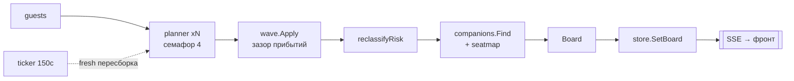

# Конвейер: как собирается табло

Путь данных: `guests → planner (параллельно) → wave → reclassify → companions + seatmap → board → store → SSE`.

## Планировщик (internal/planner)

Ключевая функция: `PlanGuest(ctx, ev, guest, fresh) (*Result, error)`. Строит маршрут одного гостя «от дедлайна назад»:

1. **Дедлайн окна**: `ev.DeadlineTime()` (момент сбора в МСК минус `BufferHours`).
2. **Pass 1, мультитранспорт**: `SearchMulti(city → destination, date, party, profile)` того же дня. Варианты дедупятся по ключу `mode|number|departure`. Если в `meta.modes_summary.railway` ноль прямых поездов, но есть `interchange_routes`, планировщик конвертирует их в пересадочные опции (`Complex=true`, номера поездов склеены через `+`, `LegLinks` хранит чекаут каждого плеча). Пустой режим без пересадок даёт запись в лог «прямых поездов нет».
3. **Pass 2, ночные поезда**: `SearchRail` на предыдущую дату. В окно попадают только прибытия в день события; такие варианты помечаются `NightBefore=true`.
4. Если опций ноль и мультипоиск упал по сети, планировщик возвращает ошибку. Оркестратор отличает её от «маршрута нет» и не затирает прежнюю строку.
5. **Фильтр окна**: `ArrivalAt <= deadline`, в вариант пишется `MarginMin` (запас до дедлайна).
6. Пустое окно → статус `needs_help` с причинами.
7. **Ранжирование** `rankOptions`: варианты дороже бюджета тонут, дальше cheaper сортирует по цене, faster по длительности (`sort.SliceStable`).
8. **Пин гостя**: если `PinnedKey` жив в новом окне, chosen остаётся закреплённым. Умер — `PinnedLost=true`, лог «collapsed», chosen становится лучшим по рангу, статус `assembled` меняется на `reassembled`.
9. `pickAlternatives` набирает до 3 альтернатив: сначала по одной на каждый другой вид транспорта, потом добивка тем же.
10. **Риски**: цена выше бюджета на человека → «дороже бюджета»; `MarginMin < 90` → «впритык»; `Complex` → «сложный маршрут».

`OptionKey(mode, number, departure)` даёт варианту стабильную идентичность между пересборками.

## Волна обнимашек (internal/wave)

`Apply(rows, spacingMin, deadline)` раскладывает прибытия так, чтобы встречающий успевал обнять каждого:

- Участвуют строки с непустым прибытием chosen, сортировка по времени прибытия.
- Гости на одном vehicle (`mode|number|arrival`) считаются одним прибытием и никогда не разводятся.
- Конфликт: прибытие раньше `предыдущее + зазор`. Волна ищет среди альтернатив самый ранний вариант в окне `[нужное время, deadline]` и свопает его в chosen; прежний chosen уходит обратно в пул альтернатив. Сдвиг фиксируется в `WaveShiftMin`.
- После каждого swap обход перезапускается на пересортированном порядке: swap может перепрыгнуть гостей ниже (регрессия из живого прогона). Потолок `len(rows)*3` прохода; каждый swap съедает одну альтернативу, цикл конечен.
- Замороженные строки (`Purchased || Pinned`) не свопаются. Конфликт записывается, следующий гость отсчитывается от этого прибытия как есть.
- Неразрешимый конфликт переводит строку из `assembled` в `waiting` с причиной «встречающий не успевает». Пометки ставятся только на финальном чистом проходе, чтобы settling-проходы не оставляли фантомов.

## Попутчики (internal/companions)

`Find(ev, rows)` ищет пары гостей с `FindCompanions=true`, у которых совпадает транспорт: равные `Mode` и непустой `Number`. Сегмент форматируется «Город → Город» (станции обрезаются до города).

Приватность держит `ForGuest(all, gid)`: без взаимного согласия чужое имя обнуляется, а `Note` заменяется на «с вами едет ещё один гость (имя — после взаимного согласия)». `SeatHint` (вагон и места) виден в любом случае. Организатор на табло видит имена; гость на своей карточке — только при обоюдном consent.

## Оркестратор (internal/orchestrator)

`BuildBoard` собирает всё табло:

1. **Фан-аут**: планирование гостей параллельно через семафор `maxConc` (дефолт 4). Купленный гость с живым prior возвращается как есть, живой поиск для него не делается.
2. `wave.Apply` → `reclassifyRisk` по финальному chosen (margin < 90 мин или over-budget → `risk`; `needs_help`, `waiting`, `reassembled`, `purchased` не трогаются).
3. `companions.Find` + `attachSeatHints`: только rail-пары, не больше 3 пар, таймаут 15 с, hint = самая дешёвая группа соседних мест.
4. Сборка Board, сортировка строк по прибытию (неразрешённые тонут через `arrivalKey = now + 100 лет`), `computeBets` при включённом тотализаторе.

**Диф «рассыпался → пересобран»** (`planRow`): `routeChanged` сравнивает mode, number, departure и цену (порог 1₽). Маршрут изменился → логи «collapsed» + «reassembled». Был chosen, а нового нет → `needs_help` и «рассыпался». Ошибка поиска при живом prior → prior сохраняется, лог «перепроверка не удалась — держу прежний маршрут». Сбой сети не выглядит как «маршрут рассыпался».

**Чекаут и карточка**: `resolveCheckout` догоняет `checkout_ref` через `CreateCheckoutLink`, если прямой URL пуст. `writeCard` просит LLM написать человеческую карточку; при неизменном маршруте переиспользует `prior.HumanCard` и экономит вызов.

**Отели** (`findHotels`): для гостей с `NeedsLodging`, check-in в день события, check-out +1 день, лимит 3, таймаут 20 с. Ошибки пишутся в лог мягко; при пустом результате сохраняются `prior.Hotels`.

**Перепроверки** (`recheck.go`): на событие — горутина с тикером `RecheckEvery` (дефолт 150 с). Тик пропускается при открытом breaker, после `GatherTime` и когда все билеты куплены. Иначе `BuildAndStore(fresh=true)` с таймаутом равным периоду. После сборки снимаются протухшие пины: `PinnedKey` очищается, если вариант не подтвердился и билет не куплен.

**Тотализатор** (`computeBets`) считает вероятность опоздания из хрупкости маршрута:

- Нет маршрута → 0.9, «маршрут ещё не собран».
- Билет куплен → база 0.03 + 0.05 за пересадку + 0.05 при margin < 90 мин, потолок 0.15.
- Остальные → база 0.05 + 0.12 за пересадку + 0.08 за ночной перегон + 0.10 за автобус (+0.06 за электричку) + 0.20 при margin < 90 (+0.08 при < 180), потолок 0.95.

`Rationale` собирает причины в читаемую строку.

**Вайб-ранг** (`RankVibeCities`): города-кандидаты обрезаются до 8; для каждой пары город × гость параллельно делается `SearchMulti` и берётся самый дешёвый вариант, успевающий к дедлайну. Итог `VibeCity{Reachable, TotalPrice, MaxArrival, Breakdown}` сортируется по Reachable ↓, затем TotalPrice ↑. LLM здесь только предлагает города; ранжируют живые цены Туту.
